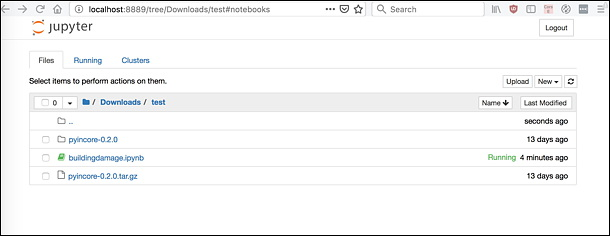
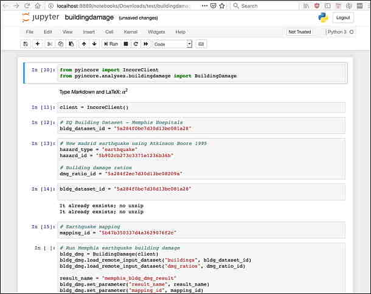

Testing pyIncore Installation
=============================

- For these instructions we assume that users develop their python script by using pyIncore in their own **project folder** (create folder if you don’t have one).

- Download the `buildingdamage.ipynb <https://incore2.ncsa.illinois.edu/doc/examples/buildingdamage.ipynb>`_  Jupyter Notebook file (right-click and choose "save link as") to your **project folder**. We will verify your installation of pyIncore by running **Building damage analysis**.

Running a Building Damage Analysis locally
^^^^^^^^^^^^^^^^^^^^^^^^^^^^^^^^^^^^^^^^^^

1. Start a local **Jupyter notebook** by running the following command in the terminal or command prompt from your **project folder** (change directories to the particular project folder at the command prompt):

    .. code-block:: bash

        jupyter notebook

    or if Jupyter Notebook is not recognized in Anaconda:

    .. code-block:: bash

        python -m notebook

    A message *The Jupyter Notebook is running* appears in the terminal/prompt and you should see the notebook dashboard open in your browser.
    **Note**  that you might be asked to copy/paste a URL into your browser when you connect for the first time:

.. image:: images/jupyter_token2.jpg
    :height: 70px
    :width: 610px
    :scale: 100%
    :alt: Jupyter Notebook token, running for the first time.
    :align: center

2. Click on the ``buildingdamage.ipynb`` in the Jupyter Notebook browser.

3. Your web page should now show multiple cells of code. Right now you are not actually running a notebook yet. Running a cell means that you will execute the cell’s contents. To execute cells in order you can just select the first cell and click the **Run** button at the top.

The **Building damage** is a long running analysis and there is little indication that it's running except by either looking at the Jupyter Notebook file and seeing the [*] for the notebook cell where that block of code is being executed or by looking at the Task Manager in the Notebook dashboard to see there is a python process running. Alternatively, you can look at the Jupyter Notebook dashboard to see if the ``csv`` file with results has been created yet.

For details of running and manipulating ipynb files refer to `Jupyter documentation <https://jupyter.readthedocs.io/en/latest/running.html#running>`_.

----

`IN-CORE home <index.html>`_
